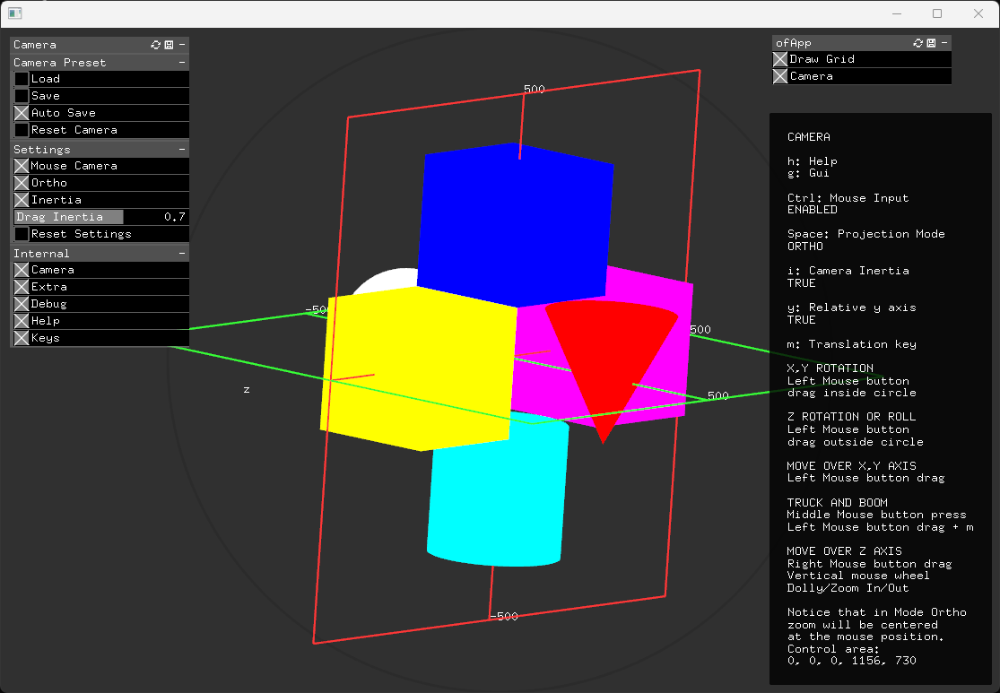
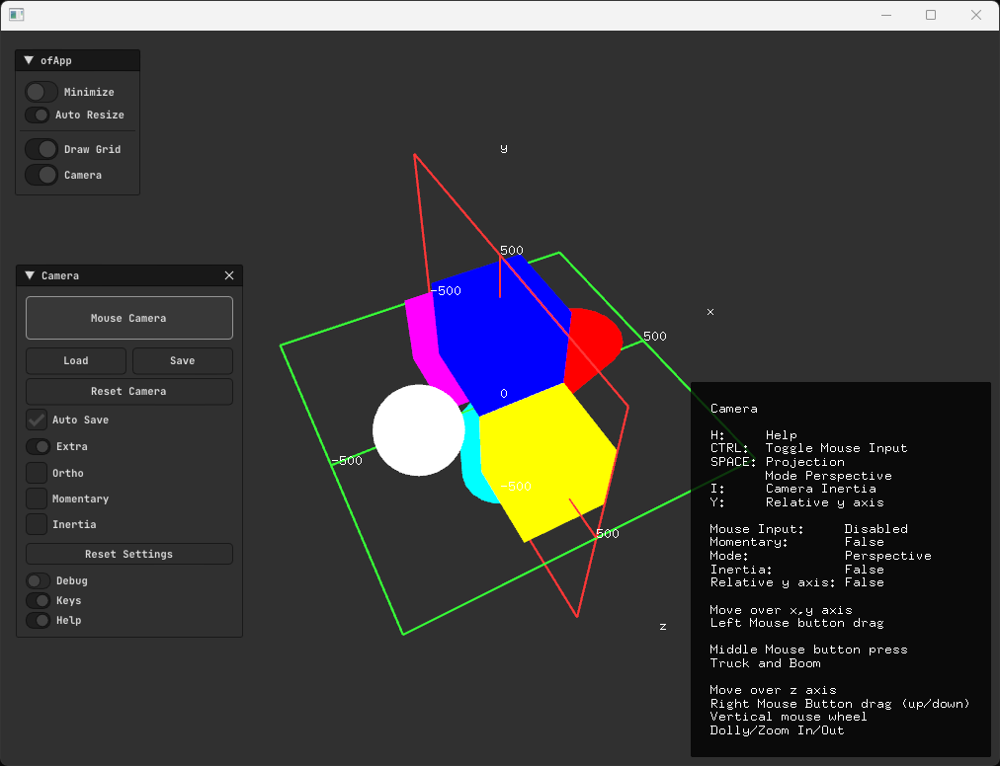

## Overview
An useful class derived from `ofEasyCam` with some helpers and features.

## Screenshots
### ofxGui

### ImGui

## Features
- Added parameters for enable mouse, inertia, projection mode...etc.
- Camera `Save`/`Load` and `Reset`.
- `Workflow` helper.
- Persistent `settings`.
- `ImGui` or `ofxGui` ready.

## Dependencies
* ofxSurfingHelpersLite
* ofxImGui
* ofxSurfingImGui
* ofxGui

Already includes into `/libs`:  
https://github.com/roymacdonald/ofxCameraSaveLoad 