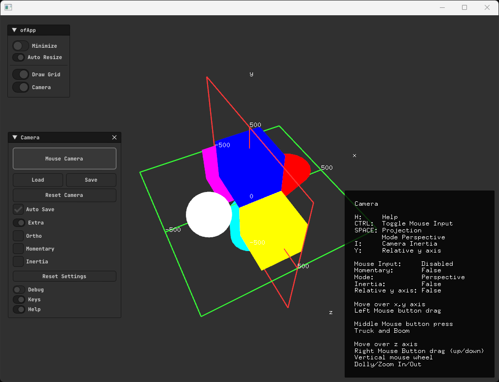

## Features
- Auto handle an `ofEasyCam`.
- Persistent settings.
- Gui.
- Workflow helper.

## Dependencies
* ofxSurfingHelpersLite
* ofxImGui
* ofxSurfingImGui
* ofxGui

Already includes into `/libs`: https://github.com/roymacdonald/ofxCameraSaveLoad 